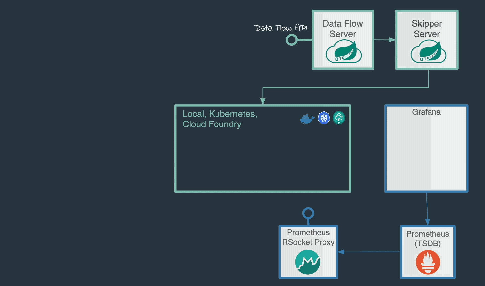

# 

## Personal Information

**Name** Karan Kartikeya

**Email** karankartikey72@gmail.com

**University** Graphic Era Hill University

**Major** Computer Science

**GitHub** [<u>KaranKartikeya</u>](https://github.com/karankartikeya)

**Location** Dehradun, Uttarakhand, India

 

# ABOUT ME

I am an undergraduate student in my pre final year of B.Tech(CS) from Graphic Era Hill University Dehradun. I am a full stack developer currently interning as a Backend Developer at Zupay.

I started with Open-source and till now I am contributing to various organizations in it. I have experience of 3 years in field of development. 

I have contributed to various communities such as MLH, FOSSASIA, GSSOC, CodeZoned, Community Classroom and many other. I have led teams in hackathon and also got special mentions in many of them.

Here I'll be submitting a proposal that could help communities new ways to analyse the community.

 

# PROBLEM STATEMENT

There are various factors when it comes to Community analytics.

How would those factors be taken into consideration? Keeping this in mind, design an analytical feature around it.

# PROJECT DESCRIPTION

As the communities keep growing each day, it becomes an important aspect to analyze the community engagement in different types.

According to the research done in past few days and experience from my previous organizations, there are various analytics meter that can be integrated in Java Spring Boot.

1. **Per User Engagement** : This analytics deals with extracting the amount of posts and comments from the database and displaying it on the community handles and user profile for boosting up the confidence and recognising the user.
2.  **Community Engagement** :  This analytics will deal with community activeness which will be dependent on the formula = (posts/server) * number of community members.

The above analytics can be either added by various paid analytics service or can be developed by using documentation provided. 
Also, we can use Druid, an open-source analytics meter. We can implement this as shown below. 

This feature can be added using Java Spring Boot Documentation. The below flowchart describes it clearly.

# CONCLUSION

I want to thank the mentors  **Aashish Ramamurthy**  and  **Sneha Prabhu**  for always being there whenever we had any query regarding the submission and product handling. Also, special thanks to SAWO and HABITATE for giving us an oppurtunity to test our skills as a developer and product tester.

