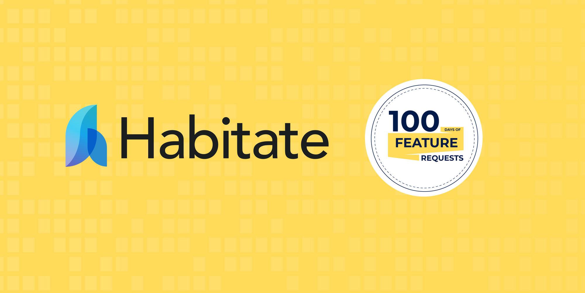

  

<h3 align="center">Habitate in 100 Days of Feature Request</h3>

 
I'm so excited to have Habitate in 100 Days of Feature Request. This is my forked repository brand of Habitat for 100 Days of Feature Request, where I will be made changes to submit my Pull Request regarding bugs as a contribution for the feature request.
      

# Bugs

## 1. Rendering - Create Tag

**Description**

- Issue on rendering when clicked **Create Tag** on members page,
- History based rendering has been freezed(like page forward/backward) and when I reload the page it wokks fine
- [video](../assets/videos/create-tag-rendering.webm)

**Solution**

- Instead of routing a page, create a component and call where ever you want in any page

## 2. Admin Controls

**Description**

- In **Members** page, admin can change his role it self.
- As **Admin** myself, when select and save wrong role, I will loose my control and some need help to recover it.
- [video](../assets/videos/create-tag-rendering.webm)

**Solution**

- Romove role selection property of loggedin user

## 3. Notification

**Description**

- **Board** have an moderation control, and some one wrinting post.
- **Admin** and **Moderator** doesn't recieve any notification for the new post on moderator board
- [video](../assets/videos/moderation_notification.webm)

**Solution**

- Enable notification features to moderated board post, that will help you more attension

## Author

- [@mdihan](https://github.com/mdihsan)

See also the list of [contributors](https://github.com/Sawo-Community/Habitate/graphs/contributors)
who participated in this challenge.
