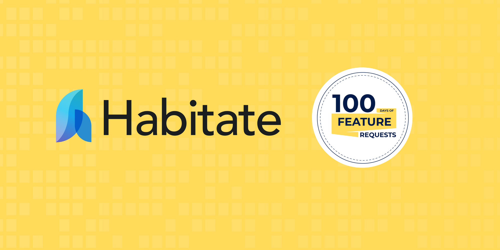

<p align="center">
  <a href="" rel="noopener">
 </a>
</p>
<h3 align="center">Habitate in 100 Days of Feature Request</h3>

<div align="center">

[](https://img.shields.io/badge/Sawo%20Labs%20Community-Habitate-blue.svg)
[]()
[](https://github.com/Sawo-Community/Habitate/issues)
[](https://github.com/Sawo-Community/Habitate/pulls)

</div>

<p align="center"> 
I'm so excited to have Habitate in 100 Days of Feature Request. This is my forked repository brand of Habitat for 100 Days of Feature Request, where I will be made changes to submit my Pull Request regarding bugs as a contribution for the feature request.
    <br> 
</p>

# Getting Started

These instructions will get you a copy of the project up and running on your local machine for development and testing purposes

## Prerequisites

What things you need to install the software and how to install them.

```
cd mdihsan && cd code
```

## Installing

A step by step series of examples that tell you how to get a development env running.

- Install [NodeJs](https://nodejs.org/en/)

```
npm install
```

## Run Server

```
npm run server
```

## Author

- [@mdihan](https://github.com/mdihsan)

See also the list of [contributors](https://github.com/Sawo-Community/Habitate/graphs/contributors)
who participated in this challenge.
