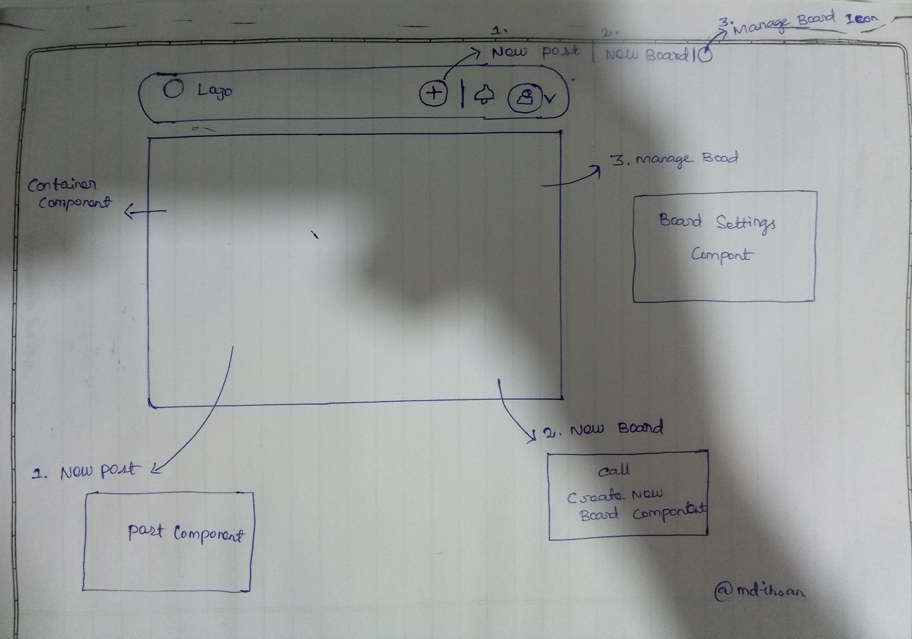

  

<h3 align="center">Habitate in 100 Days of Feature Request</h3>

 
I'm so excited to have Habitate in 100 Days of Feature Request. This is my forked repository brand of Habitat for 100 Days of Feature Request, where I will be made changes to submit my Pull Request regarding bugs as a contribution for the feature request.
      

# Product Improvement

### 1. Statement and Solutions

**Statement**

- Default **Roles** with minimal permissions

**Description**

- with the help of dynamic roles, admin can minize his work instead of overflow heavy work on his role
- here permission means settings options, when these options splitted into user default, they can manage thier community at scale easy

**Solution**

- I'm creating new role "Marketing"
- They will take care of Branding, SEO, Analitics, ete..,

### 2. Statement and Solutions

**Statement**

- **Post Approvals** and **Report as Spam**

**Description**

- Admin or moderator reject a post of users that will be deleted
- Deleted post viewed in user profile when user clicked its shows 404 Page

**Solution**

- IF user post rejected by admin or moderator, they have to tells why this post was reject user appropriate **flag** likes icons
- When user click the icon they will get rejected or as spam information

### 3. Statement and Solutions

**Statement**

- **Landing Page** customization

**Description**

- Showing **new icon** button on the header, on hover or clicked show menus like **New Post** and **New Board** with **Manage Board** icon
- Instead of using page routing, use compnent rendering.

**Solution**
</a>

## Author

- [@mdihan](https://github.com/mdihsan)

See also the list of [contributors](https://github.com/Sawo-Community/Habitate/graphs/contributors)
who participated in this challenge.
